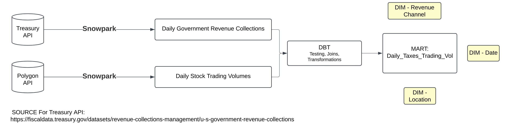
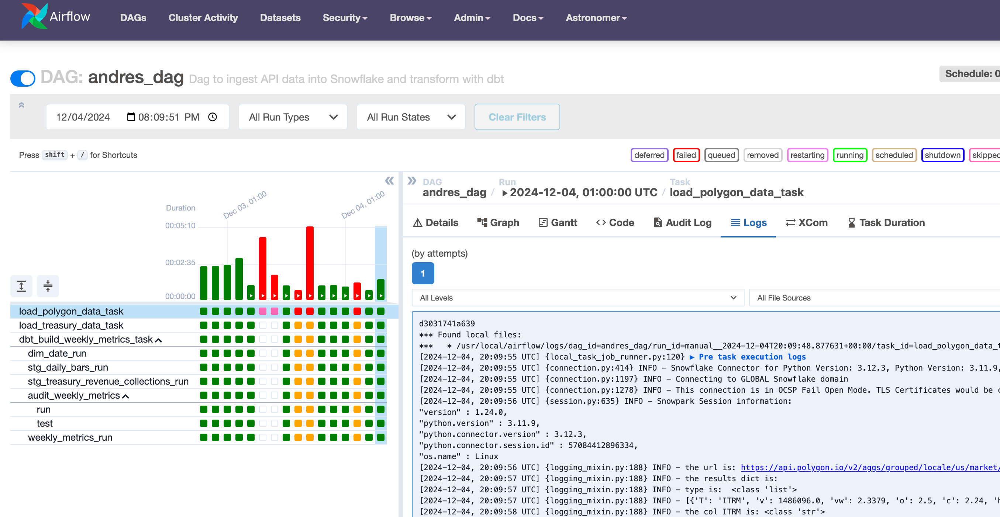
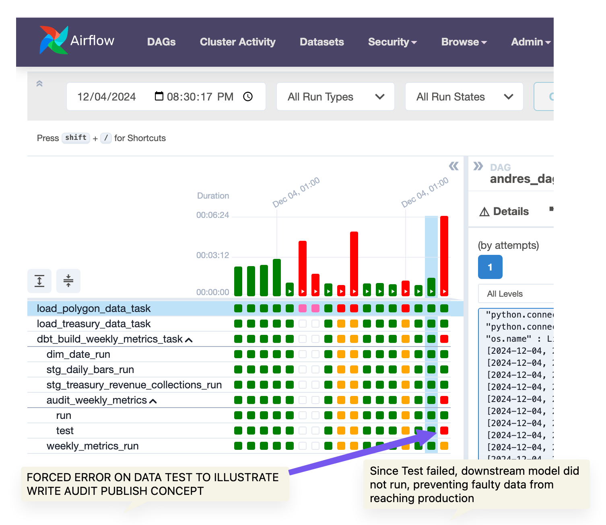
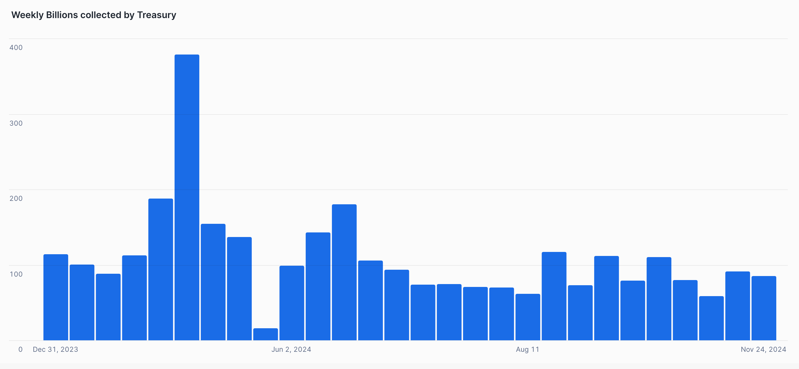
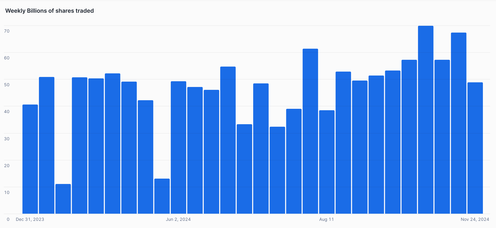

**Polygon & Treasury Data **
====================

**Table of Contents**
- Purpose of the project
- Local Development
- Dataset
- Tech Choices
- Data Model
- Steps Followed
- Challenges
- Possible Future Enhancements
- Data Quality

**Purpose of the project:**
1) First objective: Learn how to use Airflow/Cosmos with dbt core 
2) Future Objective: Track interesting economic macro stats about the US economy that are not easily obtained from google searches, Such as growing debt size and its relation to tax revenue collections. 
Note: The intention is to continue growing this project beyond the initial state. 

**Local Development:**
Airflow/Astronomer Commands on CLI:
Astro dev start, restart, stop
Astro login
Docker-compose ps → to list the containers running on docker 
Astro dev bash or docker exec -it <container-id> /bin/bash (using the scheduler name in the container-id.--> This will allow you to Run a bash command in a locally running Docker container for an Airflow component. 
airflow dags backfill -s 2024-11-10 -e 2024-11-16 capstone_andres_dag_
airflow tasks test capstone_andres_dag_ load_treasury_data_task 2024-11-11
Control D to exit

**Dataset:**
- [Polygon API](https://polygon.io/docs/stocks/get_v2_aggs_ticker__stocksticker__range__multiplier___timespan___from___to): Stock market data. Leveraged the Daily Bars Endpoint which provides a daily list of every stock in the New York Stock Exchange along with information about that stock: Trading Volume, Number of Trades, Opening/Closing Price & Highest/Lowest Price during the day. 

- [US Treasury API](https://api.fiscaldata.treasury.gov): The U.S. Government Revenue Collections dataset provides a daily overview of federal revenue collections such as individual and corporate income tax deposits, customs duties, fees for government service, fines, and loan repayments. These collections can be made through either electronic or non-electronic transactions by mail, internet, bank, or over-the-counter channels.The date included in the dataset corresponds to the date when the data was published. Therefore, this data is used at a weekly basis as an aproximation for revenues received during during said week, as there is no information on lag between collection of revenue and publishing the data.  

**Tech Choices:**

- Airflow & Astronomer: Airflow orchestrates workflows, automating the scheduling and execution of tasks. Astronomer provides a managed solution for Airflow, reducing operational overhead of managing Airflow. For example, It removes the need to: provision infrastructure (Virtual Machines), set up Airflow configurations (Postgres for metadata). If the need arises to enable larger workflows, Astronomer takes care of this.   

- Astronomer/Cosmos: Using this open source library allows Airflow to interpret dependencies within the dbt project, thereby enabling me to break up the dbt project into individual tasks (each model/test is a task). This is valuable for several reasons, including:
    1) Sometimes models or tests fail, and it is only necessary to run the model that failed and its downstream models instead fo the entire dbt project, which would add redundant compute cost. 
    2) It enables setting up Write-Audit-Publish (WAP) pattern, which is valuable to improve data quality by first "writing" the data into a staging table that gets an "Audit" or dbt test which, upon its success, the production model gets "Published" or built. This strategy guarantees that the final model only gets built if the test passed. dbt builds first and tests second. 
    3) By using the dbtTaskGroup Operator, it is possible to trigger the dbt jobs upon completion of the data ingestion tasks which are independent of dbt. While this is enabled by Airflow, its worth noting that Cosmos enables this possibility via the dbtTaskGroup operator. 

- dbt: My favorite tool in the universe! dbt is extremely powerful and effective at increasing the value of the organization's analytics in a straightforward way compared to traditional tools and frameworks. 

- Snowpark/Snowflake: Snowpark facilitates a connection between an API and Snowflake, enabling the loading of data to Snowflake via a Python script

- Visualization Tool: Initial implementation leverages Snowflake visualization capabilities, which are limited. future implementation will use a different open source tool, possibly Apache Superset, Streamlit or Grafana. 

- Docker: By containerizing the project, I avoid the "this worked on my machine" problem. The Docker container has all the configurations required to run the project, and any machine that runs the project using an "image" of this container will be able to successfully run it. 

- AWS Secret Manager: Store API Keys for security best practices

**Data Model:**

Final mart consists of a weekly aggregation of relevant metrics:
- number_of_shares_traded, number_of_trades, dolars_collected_by_treasury, irs_tax_dolars_collected_by_treasury

**Steps Followed:**
1) Develop the API scripts for Polygon and Treasury data using Python: 
- Snowpark: Open a Snowpark session to Connect to Snowflake 
- Requests python library: Request the data from the API endpoints 
- Pandas library: Store the data fetched via API in a Pandas Dataframe
- Snowpark: Delete existing data from Snowflake tables (if it exists) to avoid duplication
- Snowpark: Create a Snowpark dataframe with the data from the Pandas Dataframe
- Snowpark: Append the data to the intended table in Snowflake 

**Challenges faced:**
- In the Load Polygon Data script, I explicitly called the function. This resulted in Snowflake running this function twice per minute. It seems that when a Session is opened in a script, the script runs without schedule, possibly at a limit of twice per minute. Since the script was explicitly calling the function, it kept running over and over again

- Running backfills for specific dates from the Airflow UI. I thought this was possible, but it seems that I need to run this directly from the command line using the approriate command that specifies the dates for the backfills. Despite Catchup parameter being set to True, running a dag that had already ran only runs the latest required period. Deleting and re-running the dag results in a complete backfill. 

- Airflow often requires a restart to catch changes

- AWS secrets not getting recognized. As of this writing, I have not been able to fix this. 

**Possible future enhancements:**
- Additional data sets and data sources
  - e.g. National debt numbers by country (e.g. How much are we in debt with China), who owes the US money?
  - Tax refunds: [link](https://api.fiscaldata.treasury.gov/services/api/fiscal_service/v1/accounting/dts/income_tax_refunds_issued?&filter=record_date:eq:2005-10-03)
  - Total Gov debt: [link](https://api.fiscaldata.treasury.gov/services/api/fiscal_service/v2/accounting/od/debt_to_penny?&filter=record_date:eq:2005-10-03)

- Improved visual representation via the web

- Code improvements: Add Logging, modularize for DRY code, better formatting for code

- Finding interesting correlations
  - e.g Correlation between certain stocks getting traded vs debt/revenue collection amounts

- Expand the data model with more tables and more robust quality checks (e.g. dbt_expectations, data freshness)

**Data quality:**
- Write-Audit-Publish on final mart model
- Unit test on final mart model
- dbt testing uniqueness/nullness

SCREENSHOTS:

**Write Audit Publish**

**Graphs**

